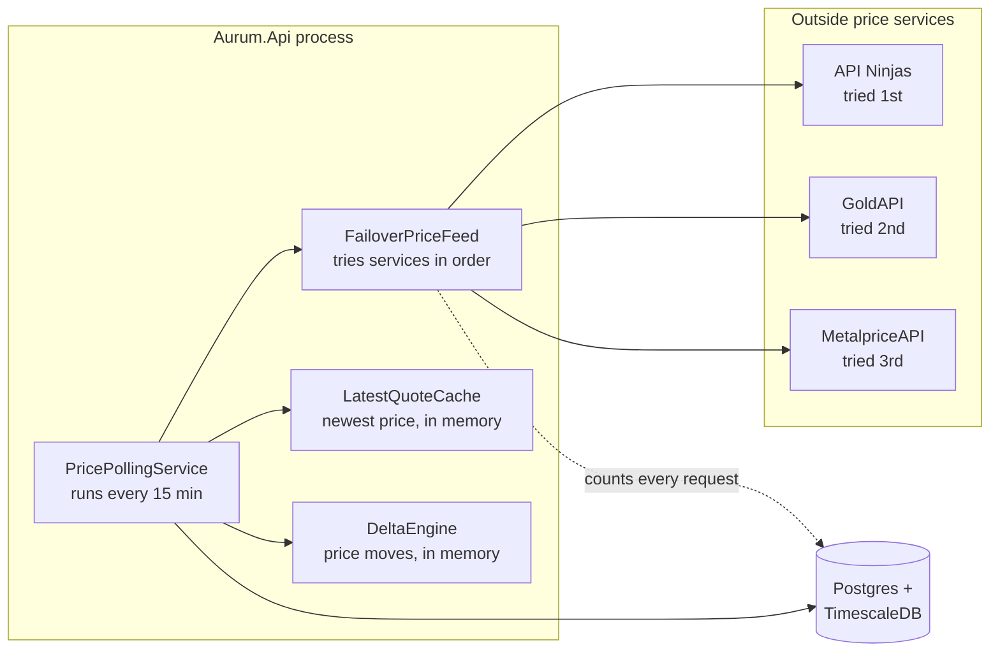
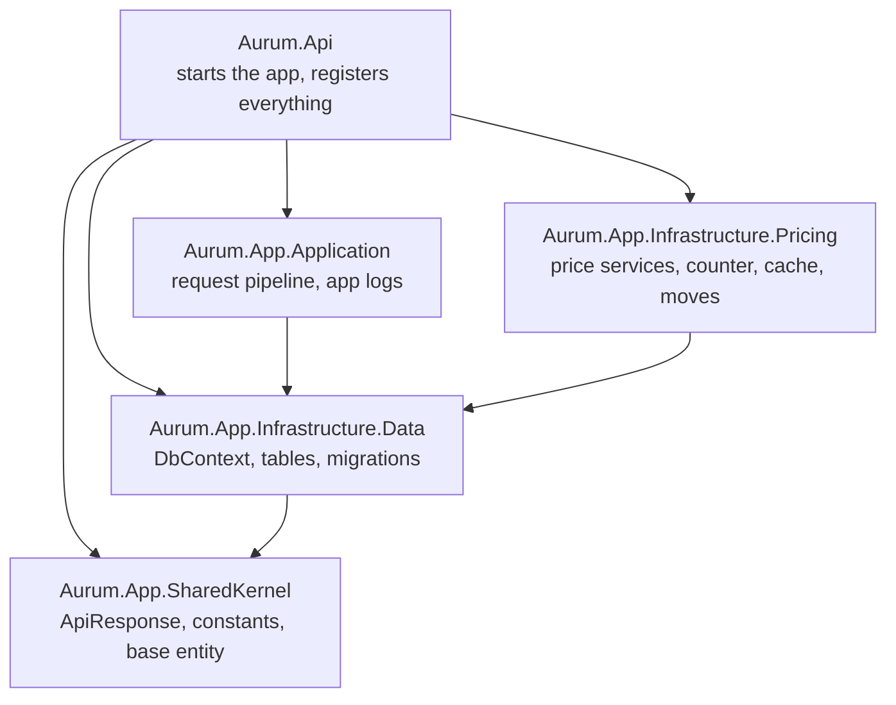
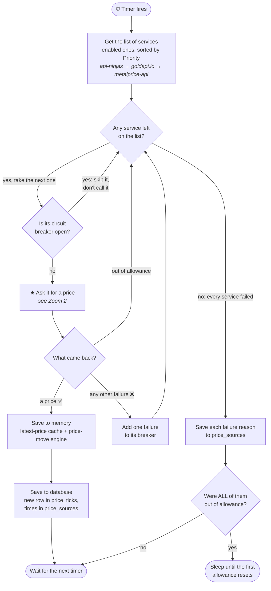
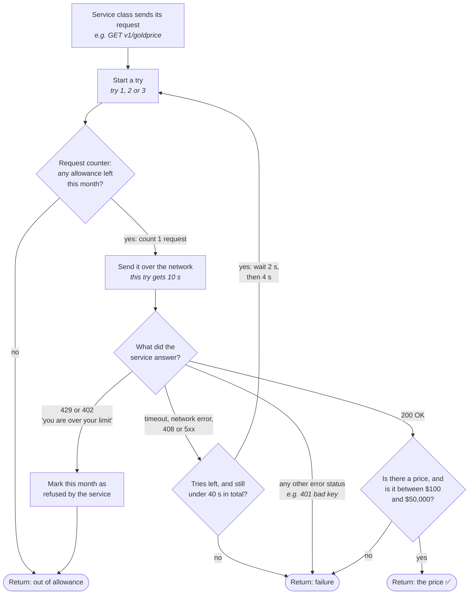

# Code overview

This document explains what the code in this repository actually does, file by file and step by
step. It is written for a developer who has just cloned the repository and wants to find their way
around before changing anything.

It sits beside the other documents like this:

| Document | What it tells you |
|---|---|
| `README.md` | What the app is for and where the project stands. |
| `CLAUDE.md` | Rules for working in the code, and the reasons behind the trickiest parts. |
| `ops/decisions/decisions.md` | Each design choice (D-1, D-2, …), with the options I turned down. |
| `ops/phase-1-todo.md` | The work still to do in Phase 1. |
| `docs/best-practices*.md`, `docs/cqrs-guide.md` | The target shape for future code. **Parts of these describe a different, larger app.** See "What the other docs describe that does not exist yet" at the end. |
| **This document** | What the code does today and how the pieces connect. |

Numbers in brackets, like (D-7), point to entries in the decision log.

Everything here was checked against the code on 2026-10-06, at commit `34d5fb1`. If you change how a
piece works, update its section here too.

---

## 1. What the app does today, in one paragraph

Aurum is a back-end service (an "API", a program other programs talk to over the web) that tracks
the price of gold. Every 15 minutes it asks an outside price service for the current gold price. If
that service fails, it tries the next one, and then a third. It saves every price it gets into a
Postgres database, keeps the newest price in memory, and works out how much the price has moved over
the last 1 minute, 5 minutes, 15 minutes, 1 hour, 4 hours and 1 day. It also counts every request it
sends to each price service, in the database, so it never goes over a service's free monthly
allowance.

**Nobody can ask the app for a price yet.** There are no web endpoints for prices. The only web
addresses that answer are the two health checks, `/health` and `/health/ready`. The endpoints, live
updates to connected apps, and the rules for "this move is big enough to flag" are later items in
`ops/phase-1-todo.md`.



---

## 2. The repository, folder by folder

```
aurum/
├── Aurum.slnx                     ← the solution file; `dotnet build` builds all of it
├── docker-compose.yml             ← runs postgres, ollama and the api together
├── .env                           ← your secrets and connection strings (not committed)
├── ops/
│   ├── db/init/01-extensions.sql  ← turns on TimescaleDB and pgvector, once, on an empty database
│   ├── decisions/decisions.md     ← the decision log
│   └── phase-1-todo.md            ← remaining Phase 1 work
├── docs/                          ← this file and the best-practice guides
├── app/                           ← the mobile/web app: an empty Expo shell for now
└── src/
    ├── Aurum.App.SharedKernel/            ← small types every project can use
    ├── Aurum.App.Infrastructure.Data/     ← the database: tables, migrations, saving
    ├── Aurum.App.Infrastructure.Pricing/  ← fetching, counting, caching and measuring prices
    ├── Aurum.App.Application/             ← request handling plumbing and app logging
    ├── Aurum.Api/                         ← the program that starts; wires everything together
    └── Aurum.Api.Tests/                   ← every test, run against a real Postgres
```

### How the projects depend on each other

An arrow means "can use code from".



`Aurum.Api` uses all four other projects because it is the one place that creates every object the
app needs (see section 3). `Aurum.App.Infrastructure.Pricing` is a fifth project the layer table in
`docs/best-practices-api.md` does not list. It exists because calling outside web services and
running a background timer are neither "database code" nor "business rules", which are the only two
boxes that table offers.

### What is in each project

**`Aurum.App.SharedKernel`** — tiny, used everywhere.

| File | What it is |
|---|---|
| `Common/ApiResponse.cs` | The single wrapper every future endpoint returns: `Success`, `Data`, `Message`, `StatusCode`, `Errors`. |
| `Common/Pagination.cs` | `PageResult<T>`, for future list endpoints. |
| `Constants/SupportedSymbol.cs` | The price symbols: `XAUUSD` (gold in US dollars) and `XAGUSD` (silver). `All` lists both. |
| `Constants/PriceEventDirection.cs` | `"Up"` and `"Down"`, for the `price_events` table. |
| `Entities/AuditableEntity.cs` | Base class that gives every table `CreatedAt` and `UpdatedAt`. |

**`Aurum.App.Infrastructure.Data`** — the database layer.

| File | What it is |
|---|---|
| `AurumDbContext.cs` | The Entity Framework (EF, the library that maps C# classes to tables) context. Defines every table, column size and index. Fills in `CreatedAt`/`UpdatedAt` on save, using the injected clock. |
| `AurumDbContextFactory.cs` | Used only by the `dotnet ef` command-line tool, so migrations can run without starting the app. Never runs in production. |
| `Entities/Pricing/*.cs` | `PriceTick`, `PriceSource`, `PriceEvent`, `ApiQuotaWindow`. |
| `Entities/Macro/*.cs` | `MacroSeries`, `MacroObservation`. Tables exist; nothing reads or writes them yet (Phase 2). |
| `Entities/Logging/AppLog.cs` | One row of the app's own durable log. |
| `Repositories/IUnitOfWork.cs` | `IUnitOfWork` and `UnitOfWork`: save changes, or run work inside one database transaction. |
| `Migrations/` | Four migrations: initial schema, extra price-service rows, app logs, price events. |

**`Aurum.App.Infrastructure.Pricing`** — almost all of the real logic lives here.

```
Aurum.App.Infrastructure.Pricing/
├── PricingOptions.cs                   ← the settings classes (sources, polling, retries)
├── PriceSourcesOptionsValidator.cs     ← refuses bad price-service settings at startup
├── PriceFeedCircuitOptionsValidator.cs ← refuses bad circuit-breaker settings at startup
├── Jobs/
│   └── PricePollingService.cs          ← the 15-minute timer; the heart of the app
├── Sources/
│   ├── IPriceSource.cs                 ← "one price service"
│   ├── GoldApiIoSource.cs              ← GoldAPI
│   ├── ApiNinjasSource.cs              ← API Ninjas
│   ├── MetalPriceApiSource.cs          ← MetalpriceAPI
│   ├── QueryKeyAuthHandler.cs          ← adds MetalpriceAPI's key to the web address
│   ├── IPriceFeed.cs                   ← "get me a price from anyone"
│   ├── FailoverPriceFeed.cs            ← tries each service in order
│   ├── SourceCircuit.cs                ← one service's circuit breaker
│   ├── SourceCircuitStore.cs           ← holds one circuit per service
│   ├── PriceQuote.cs                   ← a price, checked and cleaned up
│   ├── PriceFeedResult.cs              ← a price plus which services were tried
│   ├── SourceAttempt.cs                ← what happened when one service was tried
│   └── PriceSourceException.cs         ← the three failure types
├── Quota/
│   ├── IQuotaGovernor.cs               ← "may I send one more request?"
│   ├── PostgresQuotaGovernor.cs        ← the answer, kept in the database
│   └── QuotaHandler.cs                 ← asks the governor before every request leaves
├── Cache/
│   └── LatestQuoteCache.cs             ← newest price per symbol, in memory
└── Deltas/
    ├── DeltaEngine.cs                  ← works out price moves over six windows
    ├── TickRingBuffer.cs               ← a fixed-size list of recent prices
    ├── DeltaWindow.cs                  ← the six windows: 1m, 5m, 15m, 1h, 4h, 1d
    └── DeltaSnapshot.cs                ← the result: one move per window, or "no answer"
```

**`Aurum.App.Application`** — the plumbing for future endpoints. No feature uses it yet.

| Folder | What it is |
|---|---|
| `Common/CQRS/` | `ICommand<T>` (a request that changes data) and `IQuery<T>` (a request that only reads). CQRS stands for "command query responsibility segregation", which here just means reads and writes are separate request types. |
| `Common/Behaviors/` | Three steps every request passes through before its handler: logging, validation, and a database transaction for commands. |
| `AppLogs/` | `IAppLogService<T>`: writes log rows to the `app_logs` table without slowing the request down. |

**`Aurum.Api`** — the program you start.

| File | What it is |
|---|---|
| `Program.cs` | Creates and registers every object the app uses, sets up health checks, runs migrations, starts the web server. |
| `HttpRequestContextAccessor.cs` | Reads the user, address and request id from the current web request, for log rows. |
| `appsettings.json` | Default settings. Environment variables override them. |
| `Dockerfile` | How the `api` container is built. |

There is no `Controllers/` folder yet. The first controller comes with item 8.

---

## 3. Startup: what `Program.cs` does, in order

All registration happens in `src/Aurum.Api/Program.cs`. Registration means telling .NET's
dependency injection container (the part of .NET that creates objects and hands them to whoever
asks for them) which class to create for each interface, and how long each one lives. There are no
`Add<Something>Module` helper methods anywhere (D-5). If you add a new class that needs creating,
it goes in this file.

1. **Logging.** Serilog writes JSON lines to the console.
2. **The clock.** `TimeProvider.System` is registered once. Every timestamp the app writes comes
   from it, which lets tests swap in a fake clock.
3. **The database.** Reads `ConnectionStrings:Aurum`. **If it is empty, the app refuses to start.**
   Registers `AurumDbContext` and `IUnitOfWork`.
4. **The request pipeline.** Registers MediatR (the library that routes a request object to its
   handler), every FluentValidation validator, and the three pipeline steps. The order of those
   three lines is the order a request passes through them.
5. **App logging.** Registers the log queue (one for the whole app), the log service, and the
   background job that writes queued rows to `app_logs`.
6. **Settings.** Binds five settings sections and registers the checks for each. `ValidateOnStart()`
   means a bad setting stops the app at startup, with a message naming the setting, instead of
   failing later.
7. **Pricing objects.** The circuit store, latest-price cache and price-move engine are created once
   for the whole app, because they hold state between polls. The request counter and the failover
   feed are created fresh for each poll.
8. **The three price services.** `Program.AddPriceSource<T>` is called once per service. It sets up
   that service's web client with timeouts, retries, the request counter and the login header
   (section 6).
9. **The poller.** `PricePollingService` is registered as a background job.
10. **Health checks.** `/health` always answers "Healthy" if the process is running. `/health/ready`
    also checks it can reach Postgres.
11. **Migrations.** `MigrateAsync` applies any pending database migrations, then the web server
    starts. This is only safe with one copy of the app running; two copies migrating at once would
    clash.

### How long each object lives

This matters, because getting it wrong causes bugs that only show up under load.

| Object | Lifetime | Why |
|---|---|---|
| `TimeProvider`, `SourceCircuitStore`, `LatestQuoteCache`, `DeltaEngine`, `IAppLogQueue` | One for the whole app ("singleton") | They hold memory that must survive between polls or requests. |
| `AurumDbContext`, `IQuotaGovernor`, `IPriceFeed`, `IAppLogService<T>`, `IUnitOfWork` | One per scope ("scoped") | A `DbContext` is not safe to share between threads. A scope is one web request, or one poll. |
| Each price service class | New every time ("transient") | It holds a web client, and .NET recycles the network connections behind those every few minutes. |

**The singletons never hold a `DbContext`.** When they need the database (for warm-up at startup),
they create a short scope, use it, and throw it away. If you add a singleton that reads the
database, do the same.

---

## 4. One poll, from start to finish

This is the most important flow in the app. `PricePollingService` runs it once at startup and then
every `PricePolling:PollInterval` (15 minutes by default).

It is shown at two zoom levels. The first diagram is the whole poll, with each service treated as a
black box. The second opens up the box marked ★ and shows what happens inside one service call.
Read each one from top to bottom and follow the labelled arrows.

### Zoom 1: the whole poll



Which class owns each box:

| Box | Class |
|---|---|
| Timer, the two "Save" boxes, the "every service failed" branch | `PricePollingService` |
| "Get the list", the loop over services, the breaker checks | `FailoverPriceFeed` |
| "Is its circuit breaker open?", "Add one failure" | `SourceCircuit` |
| ★ "Ask it for a price" | `ApiNinjasSource`, `GoldApiIoSource` or `MetalPriceApiSource`, plus the layers in Zoom 2 |

**"Out of allowance" never adds a failure to the breaker.** The service is healthy, it has just
used up its requests for the month. Opening the breaker would keep it off the list even after its
allowance comes back.

### Zoom 2: inside ★, one service call



The three round ends are the three answers Zoom 1 checks for at "What came back?".

Which class owns each box:

| Box | Class |
|---|---|
| "Start a try", the retry decision, the 10 s and 40 s limits | Polly retry and timeouts, set up in `Program.AddPriceSource<T>` |
| "Request counter", "Mark this month as refused" | `QuotaHandler`, which calls `PostgresQuotaGovernor` |
| "Send it over the network" | .NET's `HttpClient`, after the login step adds the API key |
| "Is there a price…" | The service class and `PriceQuote.Normalize` |

**Every try is counted, including retries.** A poll where the first service needs all three tries
costs three requests from its allowance, not one.

### A worked example: the first service times out

API Ninjas is slow and every try times out. GoldAPI answers on the first try.

| # | What happens | Zoom | Requests counted |
|---|---|---|---|
| 1 | The timer fires. The list is api-ninjas, goldapi.io, metalprice-api. | 1 | |
| 2 | api-ninjas: breaker closed, so call it. | 1 | |
| 3 | Try 1: counter says yes, the request times out after 10 s. Wait 2 s. | 2 | api-ninjas: 1 |
| 4 | Try 2: counter says yes, times out after 10 s. Wait 4 s. | 2 | api-ninjas: 2 |
| 5 | Try 3: counter says yes, times out after 10 s. No tries left. Return: failure. | 2 | api-ninjas: 3 |
| 6 | Back in Zoom 1: "any other failure", so api-ninjas gets **one** failure on its breaker (1 of 3). | 1 | |
| 7 | goldapi.io: breaker closed. Try 1 answers 200 OK with a price of 4,412.30. | 2 | goldapi.io: 1 |
| 8 | Save to memory, then to the database. | 1 | |

That poll took about 36 seconds and spent 4 requests. The console shows (price and lag made up):

```
Primary api-ninjas did not serve this poll; goldapi.io did after api-ninjas -> goldapi.io.
Tick XAUUSD mid=4412.30 from goldapi.io, 640ms stale.
```

Step 6 is worth noticing: **three failed tries count as one breaker failure.** The breaker sees whole
calls, not tries. So a service that fails twice and works on the third try looks healthy to the
breaker, while it quietly costs three times the requests. The startup check in section 9 assumes the
worst case for exactly this reason.

### What the diagrams leave out

- **Warm-up, first run only.** Before the first poll, the poller loads the newest saved price into
  the cache and the last 36 hours of saved prices into the price-move engine. If either load fails,
  it logs the error and carries on. Memory then fills from the first poll.
- **Memory is saved before the database** (D-16). If the database save fails, the app still holds the
  price it just fetched.
- **Successes are saved too.** Each service that was called gets its `LastSuccessAt` or `LastFailureAt`
  updated in `price_sources`. A skipped service gets nothing written, so the failure that opened its
  breaker stays visible.
- **"Every service failed" never stops the timer.** Unless every service is out of allowance, the
  next poll runs on schedule. Faults and open breakers clear in minutes, so a long sleep would only
  lose prices.

Here is the poller's loop, trimmed to show the shape:

```csharp
// src/Aurum.App.Infrastructure.Pricing/Jobs/PricePollingService.cs

using var timer = new PeriodicTimer(polling.Value.PollInterval, clock);

do   // poll once straight away, then every interval
{
    try
    {
        await PollOnceAsync(stoppingToken);
    }
    catch (AllSourcesFailedException ex)
        when (ex.AllQuotaExhausted && ex.EarliestResetsAt is { } resetsAt)
    {
        // Every service is out of allowance: sleep until the first one resets
        await Task.Delay(resetsAt - clock.GetUtcNow(), clock, stoppingToken);
    }
    catch (AllSourcesFailedException ex)
    {
        // A fault or an open breaker: just wait for the next tick
        logger.LogError(ex, "Every source failed this poll; will retry on the next interval.");
    }
    // … shutdown and unexpected errors are also caught, so the loop never dies
}
while (await timer.WaitForNextTickAsync(stoppingToken));
```

What a healthy poll prints to the console (Serilog writes JSON; the message text is shown here):

```
Primary api-ninjas at 00:15:00 (2976 of 10000 requests per period).
Backup goldapi.io: 100 requests = 1.0 days of full outage coverage.
Backup metalprice-api: 1000 requests = 10.4 days of full outage coverage.
Warmed XAUUSD from stored tick: api-ninjas, observed 2026-10-06T14:00:00Z, 00:12:31 old.
Warmed XAUUSD price history: 144 of 144 stored ticks since 2026-10-05T02:12:31Z.
Tick XAUUSD mid=4412.30 from api-ninjas, 812ms stale.
```

(The numbers above are made up to show the format.)

---

## 5. The price services

Each outside service has one class that implements `IPriceSource`:

```csharp
// src/Aurum.App.Infrastructure.Pricing/Sources/IPriceSource.cs
public interface IPriceSource
{
    string Code { get; }   // "api-ninjas", "goldapi.io", "metalprice-api"
    Task<PriceQuote> GetLatestQuoteAsync(string symbol, CancellationToken ct);
}
```

A source class does one thing: send one web request, read the answer, and turn it into a
`PriceQuote`. It does not save, cache, retry or count. Those happen above or below it.

| | `ApiNinjasSource` | `GoldApiIoSource` | `MetalPriceApiSource` |
|---|---|---|---|
| Code | `api-ninjas` | `goldapi.io` | `metalprice-api` |
| Tried | 1st (`Priority: 1`) | 2nd (`Priority: 2`) | 3rd (`Priority: 3`) |
| Free allowance (setting) | 10,000 a month | 100 a month | 1,000 a month |
| Web address | `v1/goldprice` | `api/XAU/USD` | `v1/latest?base=XAU&currencies=USD` |
| How it logs in | `X-Api-Key` header | `x-access-token` header | `api_key` added to the web address by `QueryKeyAuthHandler` |
| Gives buy/sell prices? | No, one price | Yes | No, one price |
| Symbols | Gold only | Any `XXXYYY` pair | Gold only |

All three follow the same steps:

1. Gold-only services check the symbol **before** sending anything, so asking for silver costs no
   request. They throw `PriceSourceException`, not `ArgumentException`, so the feed moves on to a
   service that might carry silver.
2. Send the request. A non-success status becomes a `PriceSourceException`.
3. Note the time the answer arrived (`ReceivedAt`).
4. Read the JSON. If it cannot be read, or has no positive price, throw `PriceSourceException`.
5. Read the service's own timestamp for the price (`ObservedAt`). If it is missing, use
   `ReceivedAt` and log a warning. (Using zero would make it look like a price from 1970.)
6. Pass everything to `PriceQuote.Normalize`.

### `PriceQuote.Normalize` — the last check before a price is trusted

```csharp
// src/Aurum.App.Infrastructure.Pricing/Sources/PriceQuote.cs

// Use the service's own middle price; if it has none, the halfway point between buy and sell;
// failing that, whichever one of buy or sell exists.
var mid = providerMid
    ?? (bid.HasValue && ask.HasValue ? (bid.Value + ask.Value) / 2m : (decimal?)null)
    ?? bid
    ?? ask
    ?? throw new PriceSourceException(sourceCode, "Response contained no usable price (no mid, bid or ask).");

// A sanity range per symbol: gold must be between $100 and $50,000 an ounce.
// This catches a figure read the wrong way up (ounces per dollar instead of dollars per ounce).
if (PlausibleMid.TryGetValue(symbol, out var band) && (mid < band.Min || mid > band.Max))
    throw new PriceSourceException(sourceCode, $"Mid {mid} for {symbol} is outside the plausible band …");
```

The range is wide on purpose. It is there to catch wrong units, not to judge real market moves.
MetalpriceAPI's answer contains both dollars-per-ounce and ounces-per-dollar; reading the wrong one
gives about 0.0002, which this check refuses.

### The three failure types

All in `Sources/PriceSourceException.cs`:

| Exception | Meaning | What the feed does |
|---|---|---|
| `PriceSourceException` | The service answered, but the answer was unusable. | Counts a circuit-breaker failure, tries the next service. |
| `QuotaExhaustedException` | This service's allowance is used up until `ResetsAt`. | Tries the next service. **No** breaker failure. |
| `AllSourcesFailedException` | No service produced a price. Has an `Attempts` list. | Thrown to the poller. |

---

## 6. What happens to one web request: the per-service pipeline

Every web request a source class sends passes through a stack of layers before it leaves the
process. `Program.AddPriceSource<T>` builds this stack, the same way for every service. Only the
login step differs.

```
  GoldApiIoSource.GetLatestQuoteAsync
          │  http.GetAsync("api/XAU/USD")
          ▼
  ┌─ Total timeout (TotalTimeout, 40s) ────────────────────────────────┐
  │  ┌─ Retry: up to MaxAttempts (3) tries, waits 2s then 4s ───────┐  │
  │  │  ┌─ Per-try timeout (RequestTimeout, 10s) ────────────────┐  │  │
  │  │  │   QuotaHandler  — asks the request counter first       │  │  │
  │  │  │      │                                                 │  │  │
  │  │  │   Login step    — adds the API key                     │  │  │
  │  │  │      │                                                 │  │  │
  │  │  │   The network                                          │  │  │
  │  │  └────────────────────────────────────────────────────────┘  │  │
  │  └──────────────────────────────────────────────────────────────┘  │
  └────────────────────────────────────────────────────────────────────┘
```

Read it from the outside in:

1. **Total timeout** caps the whole sequence of tries.
2. **Retry** (from the Polly library, which handles retries and timeouts) tries again after a
   timeout, a network error, a `408 Request Timeout`, or any `5xx` server error. It does **not**
   retry on an allowance problem, or on a bad answer body; those are caught higher up.
3. **Per-try timeout** gives each try its own 10 seconds.
4. **`QuotaHandler`** asks the request counter for permission. **Because it sits inside the retry,
   every try is counted separately**, which matches how the services bill. If these two were swapped,
   retries would be free in the app's count and still billed by the service, and the app would run
   out early without knowing why. `ResilienceWiringTests` exists to catch that swap (D-7, D-13).
5. **The login step** adds the API key. For MetalpriceAPI this is `QueryKeyAuthHandler`, which puts
   the key in the web address. It is done this deep down so the key never appears in anything the
   source class logs or throws.

The registration that builds this, simplified:

```csharp
// src/Aurum.Api/Program.cs — inside AddPriceSource<T>

clientBuilder.AddResilienceHandler("price-source", (pipeline, context) =>
{
    pipeline.AddTimeout(options.TotalTimeout);           // 1. whole sequence
    pipeline.AddRetry(new HttpRetryStrategyOptions
    {
        MaxRetryAttempts = resilience.MaxAttempts - 1,   // the setting counts tries; Polly counts retries
        BackoffType = DelayBackoffType.Exponential,
        Delay = resilience.RetryBackoffBase,
        UseJitter = false,                               // must stay false (D-15)
    });
    pipeline.AddTimeout(options.RequestTimeout);         // 3. each try
});

// Registered after the line above, so it sits inside it: each retry passes through it again.
clientBuilder.AddHttpMessageHandler(sp => new QuotaHandler(/* … */));

configureAuth(clientBuilder, GetOptions);                // 5. the login step
```

`UseJitter = false` matters because Polly's web retry settings turn on random extra waiting by
default. The startup check (section 9) works out the minimum total timeout from a fixed wait
schedule; random waits would make that number wrong.

---

## 7. The request counter (quota governor)

GoldAPI's free plan allows about 100 requests a month. A counter that only lives in memory resets
whenever the app restarts, so it could spend a month's allowance in an afternoon of restarts. The
app's counter lives in the database instead, in the `api_quota_windows` table.

**One row per service per period.** A period is a calendar month for all three services today, so
the row for API Ninjas in October 2026 has `PeriodKey = '2026-10'`.

| Column | Meaning |
|---|---|
| `SourceCode`, `PeriodKey` | Which service, which month. Unique together. |
| `RequestLimit` | The allowance, copied from settings when the row is created. |
| `RequestsUsed` | How many requests the app has sent. Only ever goes up. |
| `ProviderRejectedAt` | Set when the service itself said "you're over" (HTTP 429 or 402). |
| `PeriodStartsAt`, `PeriodEndsAt` | When the period began and when the allowance comes back. |

### How `QuotaHandler` uses it

```csharp
// src/Aurum.App.Infrastructure.Pricing/Quota/QuotaHandler.cs — simplified

var lease = await governor.AcquireAsync(sourceCode, ct);       // take one request from the allowance
if (!lease.Granted)
    throw new QuotaExhaustedException(sourceCode, lease.ResetsAt);  // never touches the network

var response = await base.SendAsync(request, ct);              // send it

if (response.StatusCode is HttpStatusCode.TooManyRequests or HttpStatusCode.PaymentRequired)
{
    await governor.ReportProviderRejectionAsync(sourceCode, ct);   // the service says the app is out
    throw new QuotaExhaustedException(sourceCode, status.ResetsAt);
}
```

A request that is sent and then fails is still counted. There are no refunds, because the service
counts it too.

### Why the counter uses raw SQL

`PostgresQuotaGovernor.AcquireAsync` runs one SQL statement that both checks and adds one, in a
single step:

```sql
-- src/Aurum.App.Infrastructure.Pricing/Quota/PostgresQuotaGovernor.cs — AcquireSql
INSERT INTO api_quota_windows (... "RequestsUsed" ...) VALUES (..., 1, ...)
ON CONFLICT ("SourceCode", "PeriodKey") DO UPDATE
   SET "RequestsUsed" = api_quota_windows."RequestsUsed" + 1
 WHERE api_quota_windows."RequestsUsed" < api_quota_windows."RequestLimit"   -- still has budget
   AND api_quota_windows."ProviderRejectedAt" IS NULL                        -- service hasn't refused
RETURNING "RequestLimit" - "RequestsUsed";
```

- No row yet for this month: the `INSERT` creates it with `RequestsUsed = 1`. That is how a new month
  starts. No scheduled job is needed.
- Row exists and has budget: the `UPDATE` adds one and returns what is left. **Permission granted.**
- Row exists and is spent or refused: the `WHERE` stops the update, nothing is returned.
  **Permission refused.**

Postgres locks the row while it does this, so two requests at the same moment cannot both take the
last request. Rewriting this as "load the row in Entity Framework, check it in C#, save it" would
leave a gap between the check and the save where both could slip through. **Do not "simplify" it.**
`QuotaGovernorTests.Concurrent_acquires_never_oversubscribe` guards it.

### Reading the table

`Limit - Used` is **not** always what is left. If `ProviderRejectedAt` is set, nothing is left,
whatever the count says. A row reading "40 used of 100, rejected" is deliberate: it is the only
evidence that the app's count and the service's count disagree.

---

## 8. Memory: the circuit breaker, the latest price and the price moves

Three objects keep state in memory for the life of the process. None of them is reloaded from a
saved copy of itself; two of them rebuild from `price_ticks` at startup.

### The circuit breaker (`SourceCircuit`)

One per service, held in `SourceCircuitStore`. It stops the app calling a service that keeps
failing.

```
          3 failures in a row
 CLOSED ───────────────────────► OPEN  (service skipped, not called)
   ▲                               │
   │ next try succeeds             │ 15 minutes pass (BreakDuration)
   │                               ▼
   └──────────────────────── CLOSED again, but one failure away from OPEN
```

- Settings: `PriceFeedCircuit:FailureThreshold` (default 3) and `PriceFeedCircuit:BreakDuration`
  (default 15 minutes). Neither is in `appsettings.json`, so the defaults in
  `PriceFeedCircuitOptions` apply.
- After a break, the next normal poll is the test. One more failure re-opens it at once.
- Only failures the feed sees count: bad answers, network errors, timeouts. Running out of allowance
  does not count.
- **It starts empty on every restart, on purpose (D-14).** A failure is something this process saw
  recently. A fresh process has seen nothing, so it starts by trusting every service. The request
  counter is the opposite: a spent request stays spent.
- I wrote this instead of using Polly's circuit breaker. Polly's sits at the web-request level and
  only sees status codes. A service that answers `200 OK` with garbage looks healthy to it. This one
  sits in `FailoverPriceFeed`, where the garbage is found.

### The latest price (`LatestQuoteCache`)

Holds the newest price per symbol so a future `/v1/price/live` endpoint can answer without reading
the database.

```csharp
// What a reader gets back from cache.Get("XAUUSD")
public sealed record LatestQuoteSnapshot(
    LatestQuote Value,   // the price, whether a backup supplied it, which services were tried
    TimeSpan Age,        // now − the time the service says the price was taken
    bool IsStale);       // Age > StaleAfter (default: twice PollInterval, so 30 minutes)
```

Rules worth knowing:

- **Only a newer price replaces the held one**, judged by `ObservedAt`. An older or same-time price
  is dropped quietly.
- **Age is worked out each time it is read**, never stored. It is measured from `ObservedAt` (when the
  service says the price was taken), not `ReceivedAt` (when the app got it). Otherwise a service
  that keeps sending the same old price would look fresh forever.
- It is a plain dictionary, not .NET's `IMemoryCache`, because that one throws entries away. A price
  eight hours old would then look the same as no price at all, and the age is the point.

### Price moves (`DeltaEngine`)

Works out how far the price moved over six fixed windows: 1m, 5m, 15m, 1h, 4h and 1d. The rules for
which moves are big enough to flag (item 6) will read from this.

It keeps one `TickRingBuffer` per symbol. A ring buffer is a fixed-size list where, once full, each
new entry overwrites the oldest. Each entry is a `Sample`: the time, the middle price, and a small
number standing for the service it came from.

For each window, it works out:

```
                 window length (e.g. 1h)
        ◄──────────────────────────────────────►
  ──●───────●──────●──────●──────●──────●──────●───► time
    │       ▲                                  ▲   ▲
    │     start = last price at or            end  now
    │     before (now − 1h)                        (the clock, not the newest price)
```

1. **Start** = the last saved price at or before `now − window`. Never the first one after, which
   would quietly shorten the window.
2. **End** = the newest price.
3. Both must be close enough to where they should be: within half the window length by default
   (`DeltaEngine:ToleranceFraction = 0.5`). For the 1-hour window, the start must be within 30
   minutes of "an hour ago", and the newest price within 30 minutes of now.
4. If either rule fails, or there are not two prices, **the answer for that window is `null`, meaning
   "no answer"**. Never zero. A zero would say "the price did not move", which is a claim the app
   cannot make (D-17).

The result for one window:

```csharp
// src/Aurum.App.Infrastructure.Pricing/Deltas/DeltaSnapshot.cs
public sealed record WindowDelta(
    DeltaWindow Window,
    Sample Start, Sample End,
    decimal DeltaAbsolute,            // End.Mid − Start.Mid, in dollars
    decimal DeltaPercent,             // the same, as a percent of Start.Mid
    decimal VelocityPercentPerMinute, // DeltaPercent ÷ real minutes between Start and End
    double? Volatility,               // spread of step-to-step changes; null below 5 prices
    int SampleCount,
    bool CrossSource);                // Start and End came from different services
```

**With the shipped 15-minute poll, the 1m and 5m windows are almost always `null`.** That is
correct, not a bug: two prices 15 minutes apart cannot tell you about a 1-minute move.

`CrossSource` is a warning, not a correction. Two services can disagree by a few dollars, so a move
measured across a switch from one to another may be partly that gap.

At startup the engine loads 36 hours of saved prices, not 24. The 1d window's start price can sit up
to 12 hours before "one day ago", so stopping at 24 hours would leave the 1d window empty for a day
after every restart.

---

## 9. Settings

Settings come from `src/Aurum.Api/appsettings.json`, overridden by environment variables. A double
underscore in a variable name stands for a nested section, so
`PriceSources__GoldApiIo__ApiKey` sets `PriceSources:GoldApiIo:ApiKey`. `docker-compose.yml` passes
these through from `.env`.

| Section | Key settings | Default | What it controls |
|---|---|---|---|
| `ConnectionStrings` | `Aurum` | empty — **must be set** | The database. |
| `PriceSources:<Name>` | `SourceCode`, `ApiKey`, `BaseUrl`, `Priority`, `Enabled`, `MonthlyRequestLimit`, `QuotaPeriod`, `RequestTimeout`, `TotalTimeout` | see `appsettings.json` | One entry per service. `<Name>` is a friendly key (`GoldApiIo`); `SourceCode` is what the code matches on. |
| `PricePolling` | `PollInterval`, `StaleAfter` | 15 min, unset (= 30 min) | How often to poll; when the cached price counts as old. |
| `PriceFeed:Resilience` | `MaxAttempts`, `RetryBackoffBase` | 3, 2 seconds | Tries per request, and the first wait between them. |
| `PriceFeedCircuit` | `FailureThreshold`, `BreakDuration` | 3, 15 min | The circuit breaker. |
| `DeltaEngine` | `MaxSamplesPerSymbol`, `ToleranceFraction`, `MinSamplesForVolatility` | 8,640, 0.5, 5 | Price-move memory size and rules. |
| `Ollama` | `BaseUrl` | `http://localhost:11434` | For the local AI model planned for Phase 2. **Nothing reads it yet.** |

To look up one service's settings in code, use `PriceSourcesOptions.RequireByCode(code)`. It throws if
the service is not configured. Never write a `switch` on the code with a default branch; a made-up
default allowance is worse than a crash.

### What makes the app refuse to start

These checks run before the app reports itself healthy. Each failure message names the setting to
fix.

| Check | Where |
|---|---|
| `ConnectionStrings:Aurum` is empty. | `Program.cs` |
| An enabled service has no `ApiKey`, no `BaseUrl`, or a `MonthlyRequestLimit` below 1. | `PriceSourcesOptionsValidator` |
| A registered service has no settings entry, or two entries share a `SourceCode`. | `PriceSourcesOptionsValidator` |
| No service is enabled, or two share the lowest `Priority`. | `PriceSourcesOptionsValidator` |
| **The first service's allowance can't pay for a whole month of polls**, counting every try. | `PriceSourcesOptionsValidator` |
| `TotalTimeout` is too short for `MaxAttempts` tries plus the waits between them. | `PriceSourcesOptionsValidator.MinimumTotalTimeout` |
| `PollInterval` is not positive, or `StaleAfter` is not longer than it. | `Program.cs` / `PricePollingOptions` |
| The circuit break is not longer than `PollInterval`. | `PriceFeedCircuitOptionsValidator` |
| `MaxSamplesPerSymbol` can't hold 36 hours of prices at `PollInterval`. | `DeltaEngineOptions.BufferCoversLongestWindow` |

The month check, worked through with the shipped values: 31 days ÷ 15 minutes = 2,976 polls. Each
poll can take up to 3 tries, so up to 8,928 requests. API Ninjas allows 10,000, so it passes. GoldAPI's
100 would fail it, which is why GoldAPI is not first (D-10, D-11, D-15). Only the first service has to
pass. The backups are allowed to run out during a long outage; the counter stops them when they do.

---

## 10. The database

Postgres 17 with two add-ons, in the `timescale/timescaledb-ha:pg17` image (D-3):

- **TimescaleDB** stores `price_ticks` split by time behind the scenes, and deletes rows older than
  30 days by dropping whole chunks at once.
- **pgvector** stores the lists of numbers AI models use to compare text. Nothing uses it yet.

`ops/db/init/01-extensions.sql` turns both on the first time an empty database starts.

| Table | One row is | Written by | Read by |
|---|---|---|---|
| `price_ticks` | One price from one service. Key is `(ObservedAt, Id)`. Kept 30 days. | `PricePollingService` | Cache and delta warm-up at startup |
| `price_sources` | One price service: name, last success, last failure and why. | Seeded in migrations; `PricePollingService` updates the times | Nothing in code — for people looking at the database |
| `api_quota_windows` | One service's request count for one month. | `PostgresQuotaGovernor` | `PostgresQuotaGovernor` |
| `price_events` | A price move big enough to flag. Not split by time, so never deleted after 30 days. | Nothing yet (item 6) | Nothing yet |
| `app_logs` | One durable log entry. | `AppLogDrainService` | Nothing in code — for people |
| `macro_series`, `macro_observations` | Economic data series and their values. | Nothing yet (Phase 2) | Nothing yet |

Things that will catch you out:

- **`price_ticks` has a two-column key, `(ObservedAt, Id)`.** TimescaleDB refuses any unique index
  that leaves out the time column it splits on.
- **`price_sources.IsEnabled` and `Priority` do nothing.** Settings decide which services run and in
  what order. Changing the table changes nothing.
- **The first migration does more than create tables.** It also turns `price_ticks` into a
  TimescaleDB table, sets the 30-day deletion, and adds the GoldAPI row. Read it before adding a
  migration that touches `price_ticks`.
- **Every timestamp comes from the injected clock.** `AurumDbContext` takes a `TimeProvider` and uses
  it to fill `CreatedAt` and `UpdatedAt`. Raw SQL skips that, so raw SQL must pass those two values
  itself, as the quota governor does. The SQL `now()` function is never used.

---

## 11. The request pipeline and app logging (ready, not used yet)

This part is built and registered but has no endpoints using it. It is the path every future
endpoint will follow:

```
Web request
  → Controller                      thin: builds a command or query, calls _mediator.Send()
  → LoggingBehavior                 times it, writes a row to app_logs, warns if over 500ms
  → ValidationBehavior              runs the FluentValidation rules; throws if any fail
  → TransactionBehavior             commands only: wraps the handler in one database transaction
  → Handler                         the actual logic; maps entities to response objects by hand
  → ApiResponse<T>                  the one response shape every endpoint returns
```

The three middle steps are in `src/Aurum.App.Application/Common/Behaviors/`. They run in the order
`Program.cs` registers them.

A sketch of what the first feature will look like, using the `PriceSources` feature planned for
item 8 (these files do not exist yet):

```csharp
// src/Aurum.App.Application/PriceSources/Queries/GetPriceSourcesQuery.cs  (planned)
public sealed record GetPriceSourcesQuery : IQuery<IReadOnlyList<PriceSourceDto>>;

// src/Aurum.Api/Controllers/PriceSourcesController.cs  (planned)
[HttpGet]
public async Task<ActionResult<ApiResponse<IReadOnlyList<PriceSourceDto>>>> Get(CancellationToken ct)
{
    var sources = await _mediator.Send(new GetPriceSourcesQuery(), ct);
    return Ok(ApiResponse<IReadOnlyList<PriceSourceDto>>.CreateSuccess(sources));
}
```

`CLAUDE.md` holds the full rules for controllers, handlers, validators and their tests.

### App logging

`IAppLogService<T>` writes rows to `app_logs` without making the caller wait for the database:

```
request thread                     background
──────────────                     ──────────
AppLogService.LogAsync
   │ builds an AppLog row,
   │ fills user, address, request id
   ▼
AppLogQueue (holds up to 10,000) ──► AppLogDrainService
   full? drops the new row,            reads rows, saves them in batches of up to 100
   warns at 1st, 10th, 100th drop      a failed batch is logged to the console and dropped
```

- The queue is a singleton. A per-request queue would be thrown away with its rows when the request
  ended.
- `HttpRequestContextAccessor` fills in the user and request details. Outside a web request (for
  example, in the poller) it returns empty values instead of failing.
- The poller logs with the ordinary `ILogger<T>` (console only), not `IAppLogService<T>`.

---

## 12. Tests

Everything is in `src/Aurum.Api.Tests`. Run them with `dotnet test`. **Docker must be running**,
because many tests start a real Postgres container using Testcontainers (a library that starts
Docker containers from test code).

```
Aurum.Api.Tests/
├── Infrastructure/            ← shared test helpers
│   ├── PostgresFixture.cs     ← starts one TimescaleDB container, migrates it once
│   ├── ScriptedPriceSource.cs ← a fake price service that returns what the test says
│   ├── ScriptedPriceFeed.cs   ← a fake feed, for poller tests
│   ├── CountingHandler.cs     ← a fake network that counts requests
│   ├── ListLogger.cs          ← captures log lines so a test can check them
│   └── …
└── Modules/Pricing/           ← one test class per production class, roughly
```

| Needs Docker (real Postgres) | No container, runs in milliseconds |
|---|---|
| `QuotaGovernorTests`, `QuotaHandlerTests`, `SchemaTests`, `ResilienceWiringTests` | `SourceCircuitTests`, `FailoverPriceFeedTests` |
| `PricePollingServiceTests` | `LatestQuoteCacheTests`, `DeltaEngineTests`, `TickRingBufferTests` |
| `LatestQuoteCacheWarmupTests`, `DeltaEngineWarmupTests` | `PriceQuoteTests`, the `*OptionsTests` classes |

Run one class, or a set of fast tests:

```bash
dotnet test --filter "FullyQualifiedName~SourceCircuitTests"   # one class
dotnet test --filter "FullyQualifiedName~ResolvePeriod"        # one test name, no container needed
```

Four things to know before writing a test:

1. **Why a real database, not an in-memory one?** TimescaleDB tables and the counter's locking SQL
   behave differently from any fake. A fake would prove nothing.
2. **Tests that save prices must date them near today.** Use `PostgresFixture.RecentMinute`.
   TimescaleDB's 30-day cleanup runs on the database's real clock, so a price dated months ago can
   vanish halfway through a test, and the test fails only sometimes.
3. **Most tests use a fake clock** (`FakeTimeProvider`), so "15 minutes later" takes no real time.
   `ResilienceWiringTests` is the exception: Polly's retry waits use the real clock, and a fake one
   would make the test hang.
4. **Some tests exist to lock a decision in place**, not to find a bug. For example,
   `Transport_failure_still_spends_the_lease` is the written form of "no refunds". Don't delete one
   because it looks like it tests nothing; check the decision log first.

---

## 13. The app (`app/`)

An empty Expo shell (Expo is a toolkit for building React Native apps for phones and the web).
`App.tsx` shows a placeholder screen with a summary of fake prices from `src/fixture/generateTicks.ts`.
The chart library is chosen (`lightweight-charts`, D-2) but not installed or used. The real dashboard
is planned after the API endpoints exist.

---

## 14. Where to look when…

| You want to… | Start here |
|---|---|
| Change how often prices are fetched | `PricePolling:PollInterval` in `appsettings.json` or `.env`. The startup check tells you if the first service can't afford it. |
| Add a fourth price service | Write a class implementing `IPriceSource` (copy `ApiNinjasSource`), add a `Program.AddPriceSource<T>` call in `Program.cs`, add a `PriceSources` entry, and add a migration that inserts its `price_sources` row (the tick table's foreign key needs it). |
| Turn a service off | Set `PriceSources__<Name>__Enabled=false`. Not the database column. |
| See why prices stopped | `SELECT * FROM price_sources;` for the last failure per service, then `SELECT * FROM api_quota_windows ORDER BY "UpdatedAt" DESC;` for allowance. |
| See how many requests are left this month | `api_quota_windows`: `RequestLimit - RequestsUsed`, **and zero if `ProviderRejectedAt` is set**. |
| Change the circuit breaker | `PriceFeedCircuit:FailureThreshold` / `BreakDuration`, logic in `SourceCircuit.cs`. |
| Change the price-move windows | `DeltaWindow.cs`. They are fixed on purpose; the item 6 thresholds are tuned to them. |
| Add a new table | A new entity in `Entities/`, its setup in `AurumDbContext.OnModelCreating`, then `dotnet ef migrations add <Name> --project src/Aurum.App.Infrastructure.Data`. |
| Register a new class | `src/Aurum.Api/Program.cs`. Nowhere else (D-5). |
| Add the first endpoint | `CLAUDE.md` → "Feature Folder Structure" and "Controller Rules". |

---

## 15. What the other docs describe that does not exist yet

`docs/best-practices.md`, `docs/best-practices-redux.md`, `docs/best-practices-api.md` and
`docs/cqrs-guide.md` were written for a larger admin application. Use them as the target shape, not
as a map of this repository. In particular:

| The docs mention | In this repository |
|---|---|
| `ApplicationDbContext` | It is called `AurumDbContext`. |
| `Aurum.App.Api` | The project is `Aurum.Api`. |
| AutoMapper | Not used. Handlers map by hand, because every AutoMapper version has an unfixed security advisory. |
| Prospects, Referrals, `ReferralFileStatus`, `AppointmentStatusIds` | From the other application. None exist here. |
| Expo Router, Redux, NativeWind, Gluestack UI, `components/` | None installed. The app is an empty shell. |
| Per-layer `ServiceCollectionExtensions` / `Add<Module>Module` | Removed. Everything is in `Program.cs` (D-5). |
| Controllers, repositories | None written yet. The first ones come with item 8. |

---

## 16. Word list

| Term | Meaning here |
|---|---|
| **Poll** | One scheduled "go get the gold price" run. |
| **Tick** | One saved price: a row in `price_ticks`. |
| **Quote** | A price before it is saved (`PriceQuote`). |
| **Mid** | The middle price. The service's own figure if it gives one, otherwise halfway between buy (bid) and sell (ask). |
| **`ObservedAt` / `ReceivedAt`** | When the service says the price was valid / when the app got the answer. |
| **Source** | One outside price service. |
| **Primary / backup** | The service tried first / the ones tried after it. |
| **Lease** | One request taken from a service's monthly allowance. |
| **Quota governor** | The request counter, `PostgresQuotaGovernor`. |
| **Circuit breaker** | Stops calling a service after several failures in a row, then tries again after a rest. |
| **Failover** | Moving to the next service when one fails. |
| **Warm-up** | Loading saved prices into memory at startup. |
| **Window** | One of the six time spans a price move is measured over. |
| **Delta** | A price move over one window. |
| **Hypertable** | A TimescaleDB table that is stored split by time. |
| **Scope** | A short-lived group of objects, created for one web request or one poll and then thrown away. |
